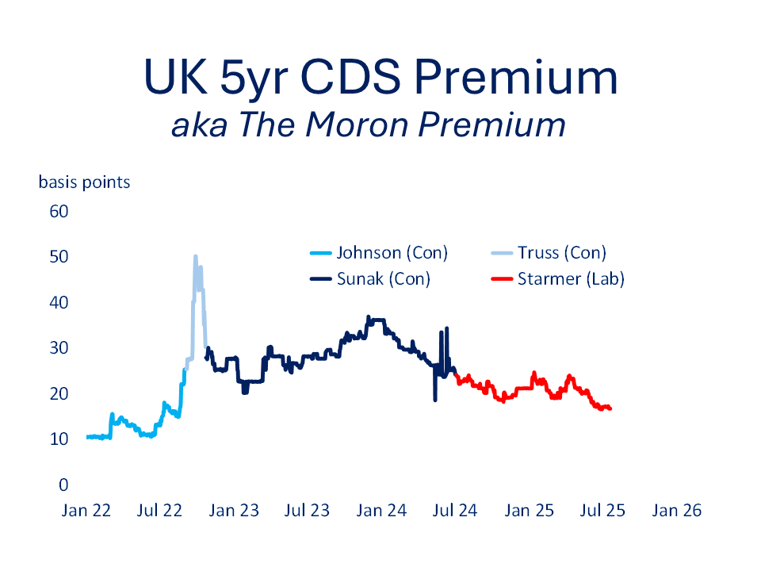

[← Back to Home](../index.html){.backlink}

# First Year Blues

Keir Starmer’s first year as UK Prime Minister has been anything but smooth. The international environment has offered little relief: Trump’s revived tariff wars, protracted conflicts in the Middle East and Ukraine, and a fresh surge in illegal Channel crossings have all added to the pressure. At home, where the government has greater agency, the story has not been much easier. Attempts to rein in welfare spending have sparked internal Labour unrest and helped propel the populist Reform Party to the top of some polls. Having voted for change, voters are seeing the familiar grind: stagnant living standards, stubborn inflation, ongoing NHS strains, and what many expect to be another round of austerity in the looming Autumn budget.

And yet, it is not all bleak. Starmer’s government has laid out long-term missions, from industrial strategy and net zero commitments to planning reform, housebuilding, childcare (via the rebranded Best Start), and moves to reassert public control over rail and water utilities. There is also a quiet but deliberate push to reboot the City’s role in global finance. Britain's standing in diplomatic circles appears to have been strengthened by Starmer's calm, unflappable style. He can read Trump, even if his methods seem cringeworthy. The problem? All of these ambitions and diplomacy take time, and electorates are famously impatient. Child poverty, special educational needs, disability, the paucity of affordable housing: complex, deep-rooted challenges that are time-intensive.

The next general election may be four years off, but global financial markets rarely wait. The collapse of Liz Truss’s premiership in the Autumn of 2022 is a blunt reminder that bond vigilantes and foreign exchange traders can be more decisive than backbench rebellions. Markets may not vote, but they do pass judgement, and when they panic, governments often fall.

# Credit Default Swaps and the Moron Premium

While UK CPI and unemployment trends are veering towards stagflation, these are not unique British problems.

```{r setup, echo: false}
#| label: setup
#| include: false
#| message: false
#| warning: false

# Global options for all chunks (can be overridden per chunk)
knitr::opts_chunk$set(
  echo = TRUE, # Default to showing code
  warning = FALSE,
  message = FALSE
)

library(tidyverse)
library(rdbnomics)
library(scales)

#################################################
### GRAPHICS THEME
#################################################
theme_sph <- function() {
  theme(plot.title=element_text(size=24,hjust=0.5,colour="#002060"),
        plot.subtitle=element_text(size=20,hjust=0.5,face="italic",colour="#002060"),
        axis.text.y=element_text(colour="#002060",size=14),
        axis.text.x=element_text(colour="#002060",angle=45,hjust=1,size=14),
        axis.title.x=element_text(colour="#002060",size=18,
                                  margin=margin(t=10,r=0,b=0,l=0)),
        axis.title.y=element_text(colour="#002060",size=18,
                                  margin=margin(t=0,r=10,b=0,l=0)),
        axis.ticks=element_blank(),
        axis.line.x=element_blank(),
        legend.text=element_text(colour="#002060",size=18),
        legend.title=element_blank(),
        panel.background=element_blank(),
        panel.grid.major=element_blank(),
        panel.grid.minor=element_blank())
}
#################################################
### OECD KEY ECONOMIC INDICATORS (MONTHLY)
#################################################
#/- EXCHANGE RATES
USD_GBP<- rdb(ids=c("OECD/DSD_KEI@DF_KEI/GBR.M.CC.XDC_USD._Z._Z._Z")) %>%
  filter(period>"2020-12-31") %>%
  dplyr::select(date=period,usdgbp=value)

USD_EUR<-rdb(ids=c("OECD/DSD_KEI@DF_KEI/DEU.M.CC.XDC_USD._Z._Z._Z")) %>%
  filter(period>"2020-12-31") %>%
  dplyr::select(date=period,usdeur=value)

#/- INFLATION
UKINF<- rdb(ids=c("OECD/DSD_KEI@DF_KEI/GBR.M.CP.GR._Z._Z.GY")) %>%
  filter(period>"2020-12-31") %>%
  dplyr::select(date=period,ukinf=value)

GERINF<- rdb(ids=c("OECD/DSD_KEI@DF_KEI/DEU.M.CP.GR._Z._Z.GY")) %>%
  filter(period>"2020-12-31") %>%
  dplyr::select(date=period,gerinf=value)

USINF<- rdb(ids=c("OECD/DSD_KEI@DF_KEI/USA.M.CP.GR._Z._Z.GY")) %>%
  filter(period>"2020-12-31") %>%
  dplyr::select(date=period,usinf=value)

#/- CALL MONEY RATE
UKCALL<- rdb(ids=c("OECD/DSD_KEI@DF_KEI/GBR.M.IRSTCI.PA._Z._Z._Z")) %>%
  filter(period>"2020-12-31") %>%
  dplyr::select(date=period,ukcall=value)

USCALL<- rdb(ids=c("OECD/DSD_KEI@DF_KEI/USA.M.IRSTCI.PA._Z._Z._Z")) %>%
  filter(period>"2020-12-31") %>%
  dplyr::select(date=period,uscall=value)

GERCALL<- rdb(ids=c("OECD/DSD_KEI@DF_KEI/DEU.M.IRSTCI.PA._Z._Z._Z")) %>%
  filter(period>"2020-12-31") %>%
  dplyr::select(date=period,gercall=value)

#/- LONG TERM BOND YIELD
UKYLD<- rdb(ids=c("OECD/DSD_KEI@DF_KEI/GBR.M.IRLT.PA._Z._Z._Z")) %>%
  filter(period>"2020-12-31") %>%
  dplyr::select(date=period,ukyld=value)

USYLD<- rdb(ids=c("OECD/DSD_KEI@DF_KEI/USA.M.IRLT.PA._Z._Z._Z")) %>%
  filter(period>"2020-12-31") %>%
  dplyr::select(date=period,usyld=value)

GERYLD<- rdb(ids=c("OECD/DSD_KEI@DF_KEI/DEU.M.IRLT.PA._Z._Z._Z")) %>%
  filter(period>"2020-12-31") %>%
  dplyr::select(date=period,geryld=value)

#/- SHARE PRICES %yoy
UKEQU<- rdb(ids=c("OECD/DSD_KEI@DF_KEI/GBR.M.SHARE.GR._Z._Z.GY")) %>%
  filter(period>"2020-12-31") %>%
  dplyr::select(date=period,ukequ=value)

USEQU<- rdb(ids=c("OECD/DSD_KEI@DF_KEI/USA.M.SHARE.GR._Z._Z.GY")) %>%
  filter(period>"2020-12-31") %>%
  dplyr::select(date=period,usequ=value)

GEREQU<- rdb(ids=c("OECD/DSD_KEI@DF_KEI/DEU.M.SHARE.GR._Z._Z.GY")) %>%
  filter(period>"2020-12-31") %>%
  dplyr::select(date=period,gerequ=value)

#/- UNEMPLOYMENT RATE
UKUNR<- rdb(ids=c("OECD/DSD_KEI@DF_KEI/GBR.M.UNEMP.PT_LF._T.Y._Z")) %>%
  filter(period>"2020-12-31") %>%
  dplyr::select(date=period,ukunr=value)

USUNR<- rdb(ids=c("OECD/DSD_KEI@DF_KEI/USA.M.UNEMP.PT_LF._T.Y._Z")) %>%
  filter(period>"2020-12-31") %>%
  dplyr::select(date=period,usunr=value)

GERUNR<- rdb(ids=c("OECD/DSD_KEI@DF_KEI/DEU.M.UNEMP.PT_LF._T.Y._Z")) %>%
  filter(period>"2020-12-31") %>%
  dplyr::select(date=period,gerunr=value)
```

```{r revealed-code, echo: true}
#| label: revealed-code
#| message: false
#| warning: false
#| fig-width: 8
#| fig-height: 10

# DATA FROM OECD via dbnomics

# Prepare Exchange Rate Index (Jan 2024 = 100)
fx_data <- full_join(USD_GBP, USD_EUR, by = "date") %>%
  filter(date >= as.Date("2020-01-01")) %>%
  mutate(
    usdgbp_idx = 100 * usdgbp / usdgbp[date == as.Date("2024-01-01")],
    usdeur_idx = 100 * usdeur / usdeur[date == as.Date("2024-01-01")]) %>%
  select(date, usdgbp_idx, usdeur_idx)

fx_long <- fx_data %>%
  select(date, USD_GBP = usdgbp_idx, USD_EUR = usdeur_idx) %>%
  pivot_longer(-date, names_to = "variable", values_to = "value") %>%
  mutate(
    country = case_when(
      variable == "USD_GBP" ~ "UK",
      variable == "USD_EUR" ~ "Germany"),
    panel = "US$ (Index Jan 2024=100)")

# Merge all series into one dataframe
merged_data <- list(
  fx_data,
  UKCALL, USCALL, GERCALL,
  UKYLD, USYLD, GERYLD,
  UKEQU, USEQU, GEREQU,
  UKINF, USINF, GERINF,
  UKUNR, USUNR, GERUNR) %>%
  reduce(full_join, by = "date") %>%
  arrange(date)

# Reshape to long format for plotting
other_data <- merged_data %>%
  select(-usdgbp_idx, -usdeur_idx) %>%
  pivot_longer(-date, names_to = "variable", values_to = "value") %>%
  mutate(
    country = case_when(
      str_starts(variable, "us") ~ "US",
      str_starts(variable, "ger") ~ "Germany",
      str_starts(variable, "uk") ~ "UK"),
    panel = case_when(
      variable %in% c("ukcall", "uscall", "gercall") ~ "Call Rates %",
      variable %in% c("ukyld", "usyld", "geryld") ~ "Bond Yields %",
      variable %in% c("ukequ", "usequ", "gerequ") ~ "Equity Index %yoy",
      variable %in% c("ukinf", "usinf", "gerinf") ~ "CPI Inflation %",
      variable %in% c("ukunr", "usunr", "gerunr") ~ "Unemployment Rate %",
      TRUE ~ NA_character_))
# Combine FX and macro series
plot_data <- bind_rows(fx_long, other_data)

# Color mapping
color_map <- c("US"="firebrick","Germany"="#002060","UK"="darkgreen")

facet_plot <- ggplot(plot_data, aes(x = date, y = value, color = country)) +
  geom_line(linewidth = 2) +
  facet_wrap(~panel, ncol = 2, scales = "free_y") +
  scale_color_manual(values = color_map) +
  expand_limits(x=as.Date('2025-10-01')) +
  scale_x_date(date_labels = "%b %Y", date_breaks = "6 months") +
  labs(x = "", y = "", 
       title = "Global Macro-Financial Scorecard",
       subtitle="OECD monthly indicators") +
  theme_sph() +
  theme(legend.position = "top",
        strip.text = element_text(size = 18,colour="#002060"),
        axis.text.x = element_text(angle=45, hjust = 1))

print(facet_plot)

```

More revealing is how UK assets are trading: despite the macro disappointments, the pound is stable, gilt yields have settled, and equities have shown resilience. This suggests that markets, unlike the electorate, are prepared to look through the short-term turbulence. But arguably the clearest market signal comes from the credit default swap (CDS) market.

A CDS is a type of insurance contract against a borrower, in this case the UK government, defaulting on its debt. The lower the spread (or premium), the lower the perceived credit risk. For highly rated sovereigns like the UK, a CDS spread below 20 basis points is healthy. Spreads spiked dramatically during the Truss episode but have since drifted downward. Under Starmer, they have continued to decline gently, suggesting a restoration of confidence, or at least a sense of predictability.\

{fig-align="center"}

That might not mean much to the average voter, or to Nigel Farage’s growing band of supporters. But it matters. Market calm buys time. And time is what Starmer’s long-term missions need if they are ever to bear fruit.
