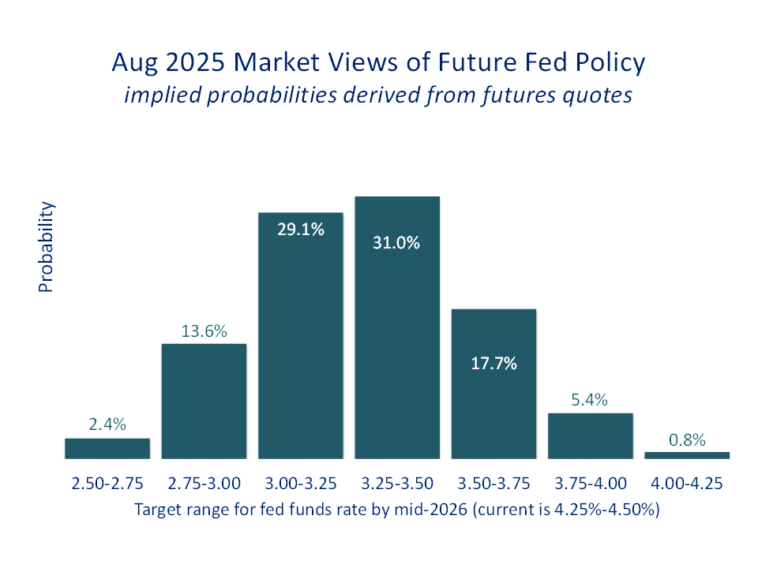
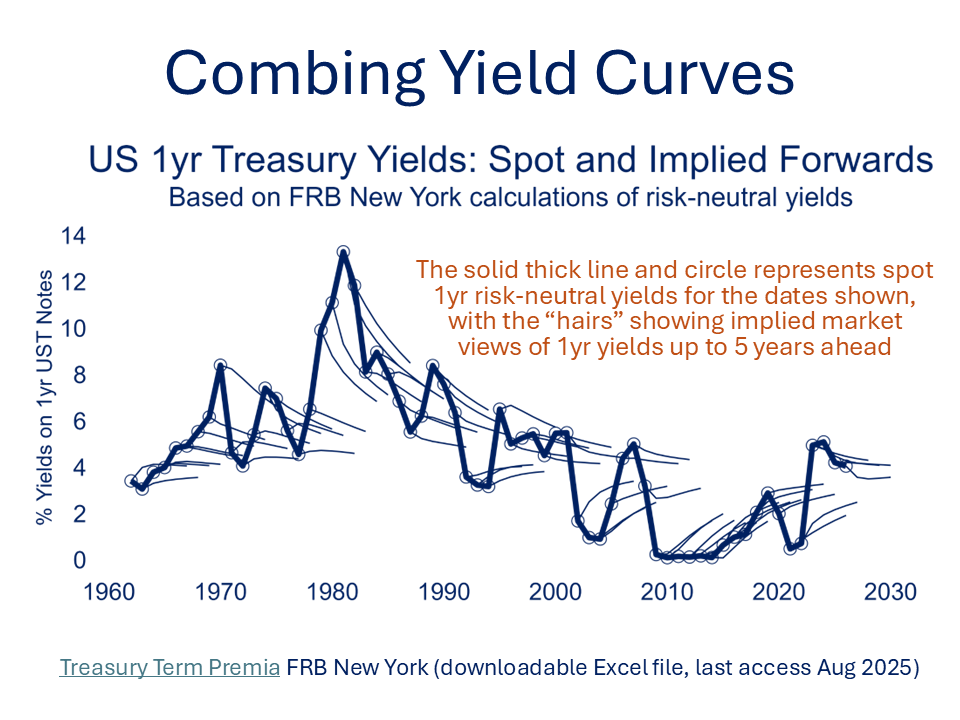

[← Back to Home](../index.html){.backlink}

## Latest Fed Announcement

At its July 2025 meeting, the Federal Open Market Committee (FOMC) opted to hold the target range for the federal funds rate steady at 4.75% - 5.00%, citing that "*Although swings in net exports continue to affect the data, recent indicators suggest that growth of economic activity moderated in the first half of the year. The unemployment rate remains low, and labor market conditions remain solid. Inflation remains somewhat elevated*". The accompanying statement retained a data-dependent tone.

The Fed's decision was widely anticipated by market participants. Christopher Waller and Michelle Bowman voted against the majority decision - the first “double dissent” by governors on the Fed’s board in more than 30 years. Despite speculation that rates will change in September, Fed Chair Powell kept his options open. UST yields and the dollar rose, while stocks retreated as markets backed away from an autumn rate cut.

|                                     | Current Level |
|-------------------------------------|---------------|
| Fed Funds Target Range              | 4.25% – 4.50% |
| Interest on Reserve Balances (IORB) | 4.40%         |
| Overnight Reverse Repo Rate         | 4.25%         |
| Discount Rate (primary, secondary)  | 4.50% - 5.00% |

## Looking Ahead

The FOMC will convene four more times before the end of 2025. Two of these meetings — September and December — will include updated Summary of Economic Projections (SEP), where participants submit their thinking for GDP growth, inflation, unemployment, and the appropriate path of interest rates.

| Date         | SEP Released? |
|--------------|---------------|
| September 17 | ✔ Yes         |
| October 29   | ✘ No          |
| December 10  | ✔ Yes         |

## The Infamous Dotplot

A key feature of the SEP is the so-called “dotplot”, a visual summary of where each FOMC participant sees the appropriate federal funds rate over the next few years, and in the “longer run". Each dot represents an individual view, but dots are anonymous and unweighted, and no indication is given of which dot belongs to the Chair or other influential figures.

Markets scrutinise the dotplot for signals about the central tendency of views, especially the median dot, which often becomes a shorthand for the Committee’s perceived stance. Movements in the median from one quarter to the next can shift market expectations dramatically.

Despite its influence, the dotplot is not a formal forecast. Each dot reflects a participant’s conditional view: what the appropriate policy would be if the economy evolves in line with their expectations. But those expectations - for inflation, employment, financial conditions - are constantly evolving.

That is why the Fed frequently emphasises that it is in “data-dependent mode”. Members may revise their views significantly if new data surprises, as has happened frequently in the post-Covid era.

Moreover, not all views carry equal weight, and the dispersion of dots can vary dramatically depending on the phase of the rate cycle. During the height of the pandemic, for instance, there was broad agreement that policy needed to remain highly accommodative. In contrast, today’s dots reveal a more diverse and uncertain outlook; a powerful reminder that even the Fed itself struggles to anticipate the future path of rates, especially when inflation shocks, geopolitical events, or supply-side disruptions intervene.

```{r dotplot, echo=TRUE}
library(tidyverse)
library(forcats)
library(scales)

dotplot<-read.csv("dotplot.csv") %>%
 mutate(Number = replace_na(FOMC.dots, 0)) %>%
  filter(Forecast.Year!="2022")
dotplot$Rangename<-gsub("Previous","Dec 2024",dotplot$Rangename)
dotplot.expanded <- dotplot[rep(row.names(dotplot), dotplot$Number), 1:3]
month_levels <- c("Latest","Dec 2024")
y1 <- factor(dotplot.expanded$Rangename,levels = month_levels)
dotplot.expanded$Rangename<-factor(y1)


ggplot(dotplot.expanded, aes(x=Forecast.Year,y=Rate,fill=Rangename),colour="#002060") +
  geom_dotplot(dotsize=5,binwidth = 1/30,stackratio=0.7,binaxis="y",stackdir="center")+
  labs(title="FOMC Projections of Fed Funds Rate (end of period shown)",
       subtitle="Latest meeting projections compared with those in Dec 2024",
       x="",y="%")+
  facet_grid(.~Rangename)+
  expand_limits(y=c(1,6))+
  scale_y_continuous("%",breaks=breaks_pretty(5))+
theme(plot.title=element_text(colour="#002060", size=24, hjust=0.5),
      plot.subtitle=element_text(size="20",hjust=0.5,face="italic",colour="#002060"),
      strip.text = element_text(size = 20,color = "#002060"),
      axis.text=element_text(colour="#002060",size=18),
      axis.title.y=element_text(colour="#002060",size=18,margin=margin(r=10)),
      panel.grid.major=element_blank(),panel.grid.minor=element_blank(),
      panel.background = element_rect(fill='transparent'), 
      plot.background = element_rect(fill='transparent',color=NA),
      axis.ticks = element_blank(),
      legend.position = "none")
```

```{r noshow, echo=FALSE}
library(fredr)
library(alfred)
library(lubridate)
library(RColorBrewer)

fredr_set_key("b983b76cb6464ac40940192891b5839f")
```

```{r fomc, echo=TRUE}
formatted_date <- format(Sys.Date(), "%e %b %Y")
formatted_date_trimmed <- trimws(formatted_date, "l")

dff<-get_fred_series("DFF",observation_start = "2020-01-01")
latestmed<-get_fred_series("FEDTARMD")

vintmed<-get_alfred_series("FEDTARMD", 
                             observation_start = "2018-01-01",
                             realtime_start = "2020-01-14")

meeting_colors <- c("2024-09-18" = "#1b9e77",
                    "2024-12-18" = "#d95f02",
                    "2025-03-19" = "#7570b3",
                    "2025-06-18" = "#e7298a")

vintmed_filtered <- vintmed %>%
  mutate(year_proj = year(date),
    meeting = as.Date(realtime_period),
    meeting_label = format(meeting, "%d %b %Y")) %>%
  filter(year_proj %in% c(2025, 2026, 2027),
    meeting >= as.Date("2024-09-18"),
    !is.na(FEDTARMD)) %>%
  arrange(meeting) %>%
  mutate(meeting_label=factor(meeting_label,levels = unique(meeting_label)))

meeting_colors <- setNames(
  brewer.pal(n = length(levels(vintmed_filtered$meeting_label)), name = "Dark2"),
  levels(vintmed_filtered$meeting_label))

ggplot(vintmed_filtered, aes(x = factor(year_proj), y = FEDTARMD, fill = meeting_label)) +
  geom_col(position = position_dodge(width = 0.8), width = 0.7) +
  labs(title = "FOMC Median Fed Funds Rate Projections (end-years)",
       subtitle = "3yr-ahead Projections since Sep 2024",
       x="Projection Year",y="Fed Funds Rate (%)",fill="FOMC Meeting") +
  scale_y_continuous(labels = number_format(accuracy = 0.1)) +
  scale_fill_manual(values = meeting_colors, drop = FALSE) +
  theme(panel.grid.major=element_blank(),
        panel.grid.minor=element_blank(),
        panel.background = element_blank(),
        plot.title=element_text(colour="#002060",size=24,hjust=0.5),
        plot.subtitle=element_text(colour="#002060",size=20,hjust=0.5),
        plot.caption=element_text(colour="#002060",size=18,face="italic",hjust=0.5),
        axis.text = element_text(color = "#002060", size = 18),
        axis.title = element_text(size = 18, colour = "#002060", vjust = 2),
        axis.ticks = element_blank(),
        legend.text = element_text(color = "#002060", size = 16),
        legend.position = "inside",
        legend.position.inside = c(0.82,0.3),
        legend.direction = "vertical",
        legend.key = element_blank(),
        legend.title = element_text(color = "#002060", size = 16))

# 1. Outturn data 
dff_endyear <- dff %>%
  mutate(date = as.Date(date)) %>%
  filter(year(date) >= 2020) %>%
  group_by(year = year(date)) %>%
  filter(date == max(date)) %>%
  ungroup() %>%
  select(year, DFF) %>%
  rename(value = DFF) %>%
  mutate(type = "Outturn")

# 2. Filter Dec projections and order meeting_label chronologically
proj_data <- vintmed %>%
  mutate(proj_year = year(date),
    meeting = as.Date(realtime_period),
    meeting_year = year(meeting),
    meeting_month = month(meeting),
    horizon = proj_year - meeting_year) %>%
  filter(((meeting_year %in% 2020:2024 & meeting_month == 12) & horizon %in% 1:3) |
        ((meeting_year == 2025 & meeting_month == 6) & horizon %in% 0:3),
        !is.na(FEDTARMD)) %>%
  mutate(meeting_label = format(meeting, "%b %Y"),
         type = case_when(horizon==0~"Projection (same year)",
         TRUE ~ paste0("Projection (",horizon,"yr ahead)")),
  x_nudge = case_when(meeting_label=="Jun 2025" & type=="Projection (same year)"~0.07,
      meeting_label=="Jun 2025"~0.0,TRUE ~ 0)) %>%
  arrange(meeting) %>%
  mutate(meeting_label = factor(meeting_label, levels = unique(meeting_label))) %>%
  transmute(year = proj_year,
            value = FEDTARMD,
            type,
            meeting_label,
            x_nudge)

dff_endyear <- dff_endyear %>%
  mutate(meeting_label = NA_character_,
         x_nudge = 0.0)

# 4. Plot data & code
plot_df <- bind_rows(dff_endyear,proj_data)
plot_proj <- filter(plot_df, type != "Outturn")

ggplot(plot_df, aes(x = year, y = value)) +
  geom_line(data=filter(plot_df, type == "Outturn"),
            linewidth = 2, color = "#002060") +
  geom_point(data = plot_proj,
    aes(color = meeting_label),
    size = 5, alpha = 0.9,
    position = position_nudge(x = plot_proj$x_nudge)) +
  scale_y_continuous(labels = number_format(accuracy = 0.1),
                     limits=c(0,6),
                     breaks=seq(0,6,by=1.0)) +
  scale_x_continuous(breaks = seq(2020, max(plot_df$year), 1)) +
  labs(title = "Median FOMC End-Yr Views vs Actual Fed Funds Rate",
       subtitle = "",
       caption=paste0("Solid line represents end-year outturns for 2020-2024\n For 2025, the figure shown is the EFF rate on ",formatted_date_trimmed),
    x = "",y = "Fed Funds Rate (%)",color="FOMC Meeting") +
  guides(color=guide_legend(override.aes=list(shape = 19, size = 5))) +
  theme(panel.grid.major=element_blank(),
        panel.grid.minor=element_blank(),
        panel.background = element_blank(),
        plot.title=element_text(colour="#002060",size=24,hjust=0.5),
        plot.caption=element_text(colour="#002060",size=18,face="italic",hjust=0.5),
        axis.text = element_text(color = "#002060", size = 18),
        axis.title = element_text(size = 18, colour = "#002060", vjust = 2),
        axis.ticks = element_blank(),
        legend.text = element_text(color = "#002060", size = 14),
        legend.position = "inside",
        legend.position.inside = c(0.1,0.7),
        legend.direction = "vertical",
        legend.key = element_blank(),
        legend.title = element_text(color = "#002060", size = 14))
```

## What Markets Think

While the dotplot shows where Fed officials think rates should go, markets form their own view. One of the clearest ways to track this is through the [CME FedWatch tool](https://www.cmegroup.com/markets/interest-rates/cme-fedwatch-tool.html), which derives implied probabilities of future rate moves from fed funds futures prices.The [Market Probability Tracker](https://www.atlantafed.org/cenfis/market-probability-tracker) published by FRB Atlanta provides additional information on market views.

{fig-align="center"}

A more general approach involves using risk-neutral interest rates across 1-year, 2-year, … up to 5-year horizons to back out the market-implied path of short-term rates. These derived 1-year forward rates act as market proxies for where the fed funds rate might be heading.Like the Fed, markets are often wrong. But they still matter, since expectations influence financial conditions in real time.

{fig-align="center"}

## Key Takeaways

Even for seasoned Fed officials, forecasting the economy, and its implications for interest rates, is fraught with uncertainty. Growth and inflation are shaped by countless moving parts, many of them beyond any central bank’s control.

That’s why point forecasts should be treated with caution, and why many policymakers now prefer scenario-based analysis or probabilistic ranges to communicate their thinking.

It also explains why the Fed tends to wait for a solid base of evidence before changing course, especially at turning points. A single month’s payroll or inflation print, however striking, is rarely enough. What matters is the trend, and the confidence with which it can be judged.
