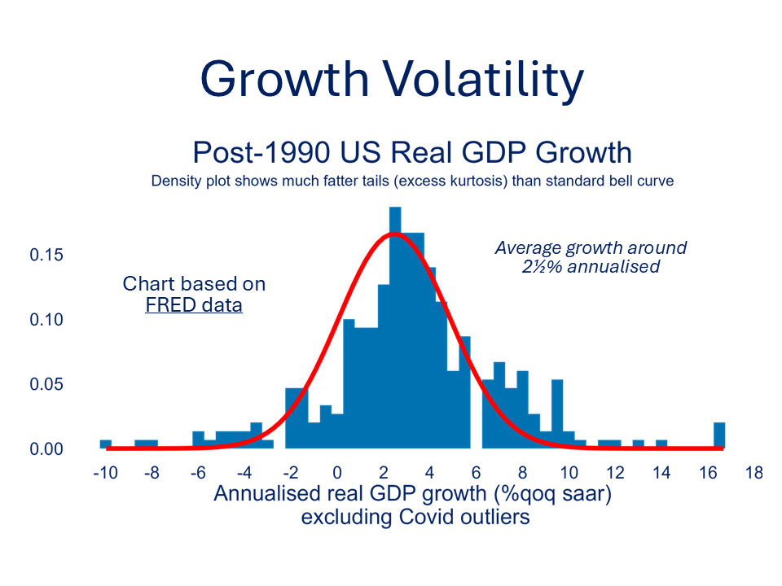
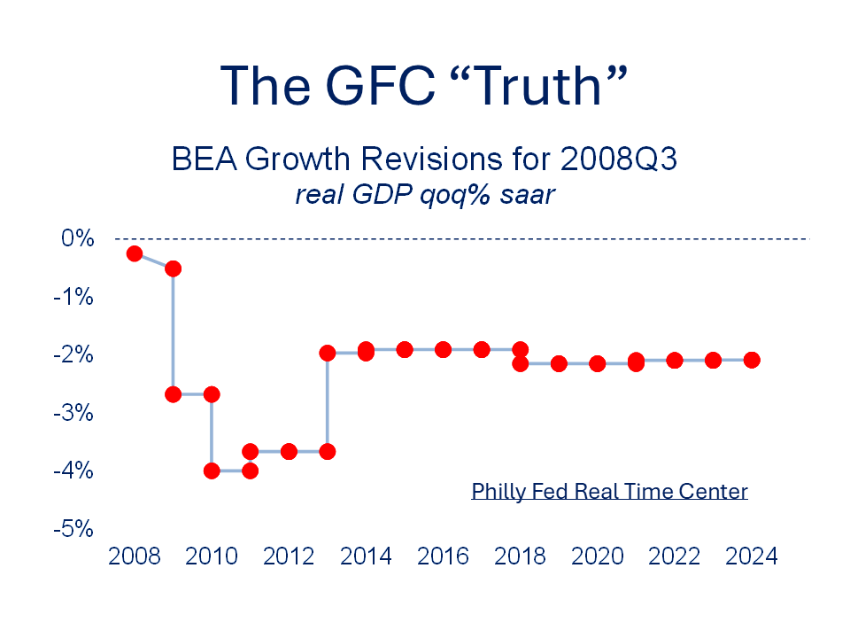

[← Back to Home](../index.html){.backlink}

# Interpreting GDP Growth

Quarterly GDP data are notoriously volatile and have been for some time. Nor does the volatility exhibit "normal" characteristics.

{fig-align="center"}

Randomness is part of life, with or without President Trump, and is [not just confined to economic outcomes.](https://www.ft.com/content/2a4fb079-5733-40b6-ac64-8d3b6b702a81)\
\
Sometimes the randomness and confusion is self-induced. Some Europeans unwittingly gaze in awe of US GDP headline growth until they realise that Americans big it all up with annualisation. We don't do that this side of the pond. A less obvious issue, and of increasing concern, is that data quality is deteriorating. Official statisticians have to make do with [less resource](https://fortune.com/2025/06/13/bls-data-federal-reserve-cpi-employment/) and surveys are finding it harder to tap willing respondents. And if unhelpful statistics upset political masters the messenger can get [fired](https://www.bbc.co.uk/news/articles/cvg3xrrzdr0o), accused of [treason](https://voxeurop.eu/en/andreas-georgiou-learns-the-unwritten-rules-of-greek-statistics/) or literally [shot](https://www.economist.com/finance-and-economics/2016/09/03/called-to-account).

Users must also remain alert with interpretation, especially where complex multinational linkages are involved. [Ireland's stellar GDP per capita](https://www.economist.com/europe/2025/06/12/how-ireland-became-the-saudi-arabia-of-siphoned-off-global-profits) is a classic example.Then there are the dreaded revisions: what really happened to US GDP when Lehman Bros went bust in 2008? The "truth" took some time to emerge, well after time-critical policy decisions had to be made.

{fig-align="center"}

So, when we look at the latest GDP numbers, the obvious question - is this quarter’s number telling us something important? - is pretty hard to answer. But economists are there to guide and we have some tools to help distinguish the noise from the signal.\
\
An easy step is to be careful about which GDP measure we use. [Jason Furman](https://www.ft.com/content/58576abe-18b0-4216-940c-6e6f6c8bda60) makes a case for focussing on core GDP rather than the headline number. Thankfully, [FRED is at hand](https://fred.stlouisfed.org/graph/?graph_id=1459584). For example, that weak 2025Q1 US GDP figure was distorted by all sorts of stuff. It's worth reading the [BEA's technical notes](https://www.bea.gov/sites/default/files/2025-04/gdp1q25-adv.pdf) on gold and the California wildfires attached to advance estimates. Not only do we need to pay attention to detail but also, as [Bobby Kennedy](https://www.theguardian.com/news/datablog/2012/may/24/robert-kennedy-gdp) eloquently reminded us, GDP does not tell you all you need to know.

There are more thorough approaches for identifying signal from noise. These methods typically involve estimating an underlying trend - the part of GDP growth that reflects longer-term, systematic changes in the economy - and separating it from the short-term fluctuations caused by temporary shocks or measurement errors.

As an example, we could use a Bayesian smoothing technique to estimate that trend. Think of it like drawing a smooth curve through a wobbly line: the smooth curve (in blue) captures the longer-term direction of growth, while the wobbly line (in grey) shows the actual, often volatile, GDP data. We also shade in an 80% credibility band around the trend line, which gives a sense of uncertainty. Most of the time, the true value of growth should fall inside this band.

So what happens when a new data point comes out? We compare it to our trend estimate and ask: Is this new number unusually far from what we expected? That’s what the signal probability table tells us. If the probability is low (e.g. 0.12), the new number is likely just noise - a short-term blip. But if it's high (eg 0.83), there’s a good chance the new data signal a genuine shift in the growth trend; perhaps due to policy changes, a new economic shock, or broader structural change.

# Analysis Code

```{r}
#| label: gdp-volatility
#| echo: true
#| message: false
#| warning: false

knitr::opts_chunk$set(echo = TRUE)

library(fredr)
library(tidyverse)
library(brms)
library(lubridate)
library(tidybayes)
library(scales)

# setwd(dirname(rstudioapi::getActiveDocumentContext()$path)) # Commented out for Quarto rendering
# getwd() # Commented out
# rm(list=ls()) # Commented out

# API Key Retrieval
# The FRED API key is retrieved from an environment variable for security.
api_key <- Sys.getenv("MY_API_KEY")
if (api_key =="") {
stop("API key 'MY_API_KEY' not found. Please set it as an environment variable in .Renviron.")
}

fredr_set_key(api_key)

# Data Import and Preparation
# We import historical Real Gross Domestic Product (GDPC1) data from the
# Federal Reserve Economic Data (FRED) database. The data is then transformed
# to year-over-year (YoY) growth rates. A dummy variable for the COVID-19
# period (2020-2021) is also created for later exclusion in the trend model.

gdp_raw <- fredr(series_id = "GDPC1", observation_start = as.Date("1960-01-01")) %>%
select(date, value) %>%
mutate(
yoy = (value / lag(value, 4) - 1) * 100,
quarter = year(date) + (quarter(date) - 1) / 4,
covid = if_else(date >= as.Date("2020-01-01") & date <= as.Date("2021-12-31"), 1, 0)
) %>%
filter(!is.na(yoy))

# Glimpse of the prepared data:
gdp_raw %>% 
  {rbind(head(., 4), tail(., 4))} %>%
  knitr::kable(caption = "<span style='color:white;'>Selected Rows of GDP Dataframe</span>",escape=FALSE)

# Fit a Smooth Trend Model (ex-Covid) up to the end of 2024
# A Bayesian smooth trend model is fitted to the year-over-year GDP growth
# (excluding data from the COVID-19 period given the unusual economic
# disruptions during that time)

train_data <- gdp_raw %>% filter(date <= as.Date("2024-06-30"))

trend_model <- brm(
formula = bf(yoy ~ s(quarter)),
data = train_data %>% filter(covid == 0),
family = gaussian(),
chains = 4, iter = 4000, cores = 4,
control = list(adapt_delta = 0.95),
seed = 1234
)

# Posterior draws from the fitted trend model are used to generate predictions
# across the entire dataset, including the latest outturns. This allows for
# a robust estimate of the underlying trend and its uncertainty.

# Define test set
test_data <- gdp_raw %>% filter(date > as.Date("2024-12-30"))

# Combine for prediction
pred_data <- bind_rows(train_data, test_data) %>%
select(date, quarter, yoy, covid)

pred_draws <- add_epred_draws(object = trend_model, newdata = pred_data, ndraws = 1000)

# Plot Actual vs Estimated Trend
# The plot below visualizes the actual year-over-year GDP growth alongside
# the estimated smooth trend and its 80% credible interval. Recent outturns
# (from 2025Q1 onwards) are highlighted in red.

pred_summary <- pred_draws %>%
  group_by(date) %>%
  median_qi(.epred, .width = 0.8) %>%
  left_join(pred_data, by = "date")
```

# Plotting Results

```{r}
#| label: gdp-trend-plot
#| echo: false
#| message: false
#| warning: false

ggplot(pred_summary, aes(x = date)) +
  geom_line(aes(y = yoy), color = "darkgray", linewidth = 1.0) +
  geom_line(aes(y = .epred), color = "blue",linewidth = 2.0) +
  geom_ribbon(aes(ymin = .lower, ymax = .upper), fill = "blue", alpha = 0.2) +
  geom_point(data = filter(pred_summary, date > as.Date("2024-12-30")),
             aes(y = yoy), color = "red", size = 3) +
  annotate("text", x = as.Date('2000-01-01'), y = -5, 
           label = "Estimated Trend (ex-Covid)",
           colour="blue",size=5)+
  annotate("text", x = as.Date('2000-01-01'), y = -6, 
           label = "Outturns since 2025Q1",
           colour="red",size=5)+
  labs(title = "US Real GDP YoY Growth",
       subtitle="Actual vs Estimated Trend 1960-2026",
       y = "% YoY Growth", x = "Date")+
  theme(plot.title=element_text(size=28,hjust=0.5,colour="#002060"),
        plot.subtitle=element_text(size=24,hjust=0.5,face="italic",colour="#002060"),
        axis.title.y=element_text(size=18,colour="#002060",vjust=2,
                                  margin=margin(t=0,r=10,b=0,l=0)),
        axis.title.x=element_blank(),
        axis.text=element_text(color="#002060",size=16),
        axis.ticks=element_blank(),
        legend.text=element_text(colour="#002060",size=14),
        legend.title=element_text(colour="#002060",size=18),
        legend.position="top",
        #legend.position.inside = c(0.5,0.9),
        #legend.key=element_blank(),
        panel.grid.major=element_blank(),
        panel.grid.minor=element_blank(),
        panel.background = element_rect(fill='transparent'), 
        plot.background = element_rect(fill='transparent',color=NA))+
  expand_limits(x=as.Date('2030-01-01')) +
  scale_x_date(breaks=pretty_breaks(10))
ggsave("noise_signal.png",bg='white',width=160,height=120,units="mm",dpi=300)

# Probability of Outturn ≠ Trend
# To quantify whether recent outturns significantly deviate from the estimated
# trend, we calculate the posterior probability that the actual outturn
# differs from the trend by more than a certain threshold (e.g., 1.28 standard
# deviations of the trend's posterior distribution, which corresponds to roughly
# an 80% interval). This provides a "signal" indicator for deviations.

signal_prob <- pred_draws %>%
  filter(date > as.Date("2024-06-30")) %>%
  left_join(test_data %>% select(date, actual = yoy), by = "date") %>%
  group_by(date) %>%
  summarise(prob_diff = mean(abs(.epred - actual) > sd(.epred) * 1.28))

signal_prob %>%
  knitr::kable(caption = "<span style='color:white;'>Probability of Significant Deviation from Trend</span>",escape=FALSE)

# Optional Add-on for Diagnostics
# These lines are commented out but can be uncommented for model diagnostics.
# They provide summary statistics and diagnostic plots for the brms model.
# 
# - `summary(trend_model)`: Provides parameter estimates, MCMC diagnostics, etc.
# - `plot(trend_model)`: Shows trace plots and posterior distributions.
# - `pp_check(trend_model)`: Compares posterior predictive distributions to observed data.

# summary(trend_model)
# plot(trend_model)
# pp_check(trend_model)
```

# Takeaways

By the time the 2026Q3 US GDP data are released (the advance estimate is scheduled for 29 Oct 2026), such methods can quantify whether the number reflects meaningful economic change or not. This helps avoid overreacting to headlines and anchors policy and business decisions in a more stable view of economic momentum. The Bayesian approach, though advanced behind the scenes, offers a powerful and intuitive way to think about the economy as a dynamic system: evolving over time, but not at the mercy of every bump in the road.

