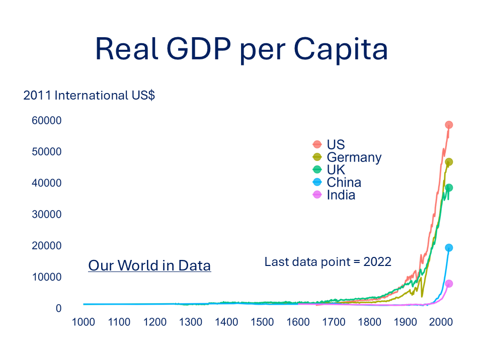
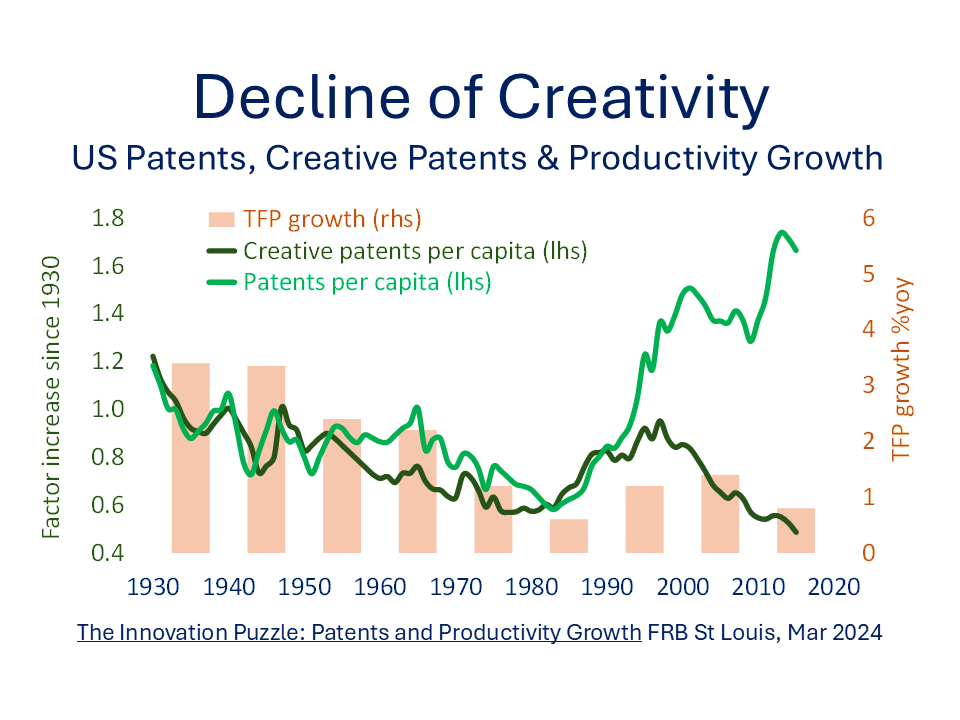
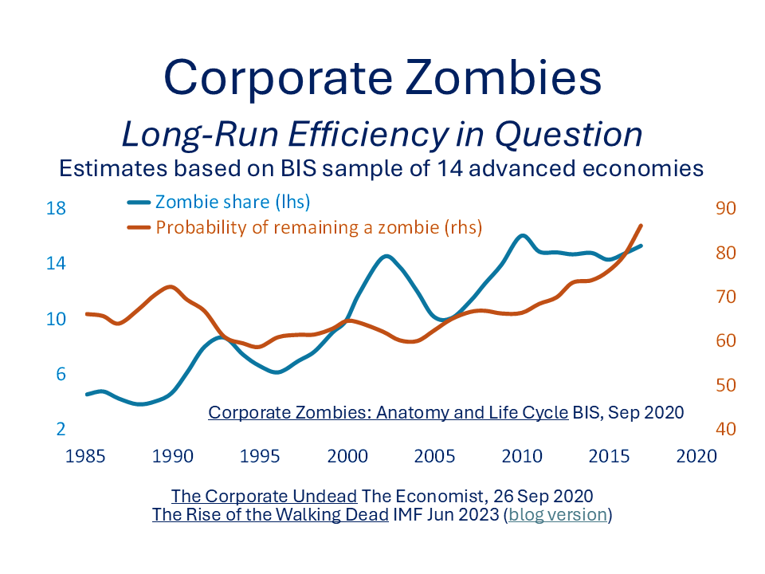

[← Back to Home](../index.html){.backlink}

# Introduction

Productivity growth – often captured by **Total Factor Productivity (TFP)** – is a central driver of living standards over the long run. A simple simulation shows that just small changes in TFP growth can compound to large differences over time.

The following example, using a simple model of production, shows how much GDP per capita can change over a generation (30 years) if annual TFP growth is just 25 basis points (0.25%) higher.

# Econ101 production model

The standard Cobb-Douglas production function can be written as:

$$
Y = A K^{\alpha} L^{1-\alpha}
$$

where:

-   $Y$ is total output (GDP),
-   $A$ is total factor productivity (TFP),
-   $K$ is capital,
-   $L$ is labour,
-   $\alpha$ is capital's share of income (typically \~0.3-0.4).

# Key assumptions

-   **Initial GDP per capita:** \$60,000\
-   **Time horizon:** 30 years\
-   **TFP growth baseline:** 1.00% per annum\
-   **TFP growth scenario:** 1.25% per annum

# Scenario vs Baseline

```{r}
# Load packages
library(tidyverse)
library(scales)

# Parameters
years <- 0:30
initial_gdp <- 60000
tfp_growth_baseline <- 0.01   # 1.00% p.a.
tfp_growth_scenario <- 0.0125 # 1.25% p.a.

# Create data frame
gdp_df <- tibble(
  year = years,
  baseline = initial_gdp * (1 + tfp_growth_baseline)^year,
  scenario = initial_gdp * (1 + tfp_growth_scenario)^year
) %>%
  pivot_longer(cols = c(baseline, scenario),
               names_to = "case",
               values_to = "gdp_pc")

# Preview
gdp_df %>% {rbind(head(., 8), tail(., 6))}
```

# Plot

```{r}
label_df <- gdp_df %>%
  group_by(case) %>%
  filter(year == max(year)) %>%
  ungroup()

ggplot(gdp_df, aes(x = year, y = gdp_pc, color = case)) +
  geom_line(linewidth = 2) +
   geom_text(data = label_df,
            aes(label = ifelse(case == "baseline",
                               "Baseline: 1.00% TFP growth",
                               "Scenario: 1.25% TFP growth")),
            hjust = 0, vjust = -0.5, size = 5, show.legend = FALSE) +
  scale_y_continuous(labels = dollar_format()) +
  labs(
    title = "GDP per capita under different TFP growth rates",
    subtitle = "Initial GDP per capita = $60,000 | Horizon = 30 years",
    x = "Years",
    y = "GDP per capita (real US$)"
  ) +
   scale_color_manual(
    values = c("baseline" = "#002060", "scenario" = "firebrick")
  ) +
  theme(plot.title=element_text(size=16,hjust=0.0,colour="#002060"),
        plot.subtitle=element_text(size=16,hjust=0.0,face="italic",colour="#002060"),
        axis.title.y=element_text(size=18,colour="#002060",vjust=2,
                                  margin=margin(t=0,r=10,b=0,l=0)),
        axis.title.x=element_text(size=18,colour="#002060",vjust=2,
                                  margin=margin(t=10,r=0,b=0,l=0)),
        axis.text=element_text(color="#002060",size=16),
        axis.ticks=element_blank(),
        panel.grid.major=element_blank(),
        panel.grid.minor=element_blank(),
        panel.background = element_rect(fill='transparent'), 
        plot.background = element_rect(fill='transparent',color=NA),
        legend.position="none") +
  scale_y_continuous(labels = dollar_format(), limits = c(NA, 90000))+
  scale_x_continuous(breaks=pretty_breaks(6),limits = c(NA, 39))
```

# What Exactly is Productivity?

Productivity sounds like a simple idea — doing more with less —but even its basic definition can be surprisingly slippery. Most people take it to mean "output per person," but that opens up a whole series of questions. What exactly counts as "output"? Are we talking about total GDP, just private sector output, or something else entirely?

And who counts as a “person” in this context? The entire population, or just those in paid employment? Even then, we need to be careful. Output per worker is not the same as output per hour worked.

{fig-align="center"}

A country where most people work part-time or have shorter standard working weeks will naturally look different from one where long hours are the norm. So, before drawing international comparisons or policy conclusions, it is worth pausing to understand exactly how productivity is being measured.

Most of these are **average** measures: total output divided by total inputs. But economists are often more interested in what is happening at the margin — that is, what difference an extra hour of work or one more worker makes. **Marginal productivity** can tell a very different story from the average. For instance, if a company is already operating efficiently, adding another worker might produce very little additional output, even if the average output per worker looks healthy.

And we are not just talking about labour here. What about the contributions of capital equipment, technological know-how, or the broader environment - things like legal systems, transport infrastructure, or stable governance? These influence how productive a country can be, even if they don’t show up in headcount or working hours. That is why economists often talk about **total factor productivity (TFP)**; a catch-all term for the part of output growth that cannot be explained by just adding more labour or capital. It is the "*secret sauce*" that reflects efficiency, innovation, and all the unseen ingredients that make an economy tick.

Importantly, TFP is not always a force for good. A financial meltdown, climate change, political regime changes can collapse a production function - not simply a temporary, negative supply shock but a wholesale, prolonged TFP disaster.

# Why Isn’t Productivity Booming?

Given the headline-grabbing advances in artificial intelligence, biotechnology, and quantum computing, you might expect total factor productivity to be soaring. And yet the US, operating at the tech innovation frontier, continues to show sluggish TFP growth.

```{r}
# Load packages
library(tidyverse)
library(stringr)
library(lubridate)
library(openxlsx)
library(scales)
library(mFilter)
library(patchwork)

rawdata_quarterly<-read.xlsx("https://www.frbsf.org/economic-research/files/quarterly_tfp.xlsx",sheet=2,cols=c(1,14),rows=c(2:316)) 

# Clean and convert to proper Date format
qdata_clean <- rawdata_quarterly %>%
  mutate(date_clean = str_replace(date, ":", ""),
    year = as.numeric(str_sub(date_clean, 1, 4)),
    quarter = str_sub(date_clean, 5, 6),
    month = case_when(
      quarter == "Q1" ~ "01",
      quarter == "Q2" ~ "04",
      quarter == "Q3" ~ "07",
      quarter == "Q4" ~ "10",
      TRUE ~ NA_character_),
    date_final = as.Date(paste0(year, "-", month, "-01")))

qplotdata_wide<-qdata_clean %>%
  dplyr::select(date=date_final,dtfp_util) %>%
  drop_na() 
##### HP SMOOTHER ###########
qtsdata<-qplotdata_wide %>%
  dplyr::select(date,dtfp_util) 
qtseries<-ts(qtsdata$dtfp_util,start=c(1947,2),frequency=4) # (1947,2) = 1947Q2 start
hp_tfp<-hpfilter(qtseries,freq=1600)

trend_tfp<-as.numeric(hp_tfp$trend) #CHECK SUFFICIENT DATA LENGTH 

tempdf<-qplotdata_wide %>%
  dplyr::select(date,dtfp_util) %>%
  mutate(trend=trend_tfp) 

ggplot(tempdf,aes(x=date))+
  geom_line(aes(y=dtfp_util),colour="gray",linewidth=1) +
  geom_line(aes(y=trend),colour="navy",linewidth=2) +
  labs(title="US TFP Growth (factor utilisation adjusted)",
       subtitle="Hodrick-Prescott Filter (\U03BB = 1600)",
       caption="Data from FRB San Francisco",
       x="",
       y="% change year-on-year")+
  theme(plot.title=element_text(color="#002060", size=24,hjust=0.5),
       plot.subtitle=element_text(color="#002060",size=18,hjust=0.5),
       plot.caption=element_text(color="#002060",size=14,hjust=0.0),
       legend.text=element_text(colour="#002060",size=18),
       legend.title=element_blank(),
       legend.position = "inside",
       legend.position.inside=c(0.3,0.8),
       legend.key=element_blank(),
       legend.background = element_rect(fill="transparent"),
       axis.title.y.left=element_text(size=14,colour="#002060",vjust=2),
       axis.title.y.right=element_text(size=14,colour="#002060",vjust=2),
       axis.text=element_text(color="dark blue",size=16),
       axis.ticks=element_blank(),
       panel.background = element_rect(fill='transparent'), #transparent panel bg
       plot.background = element_rect(fill='transparent', color=NA), #transparent plot bg
       panel.grid.major=element_blank(),
       panel.grid.minor=element_blank())+
  scale_y_continuous(breaks=pretty_breaks(10))+
  scale_x_date(breaks=pretty_breaks(10)) 

```

How can this be? One influential explanation comes from economist [Robert Gordon](http://www.ted.com/talks/robert_gordon_the_death_of_innovation_the_end_of_growth), who argues that today’s innovations—while flashy—don’t match the life-changing economic impact of earlier breakthroughs like electricity, the internal combustion engine, or even the humble flushing toilet. In short, the modern tech revolution may be impressive, but less useful than those in previous centuries. Maybe the best times are really behind us?

{fig-align="center"}

A related view is that we have already harvested many of the "[low-hanging fruit](https://www.amazon.co.uk/Great-Stagnation-Low-Hanging-Eventually-eSpecial-ebook/dp/B004H0M8QS)" of growth. Think of the massive productivity gains made in the 20th century through expanding access to education, bringing women into the labour force, and concentrating activity in urban areas where ideas and skills are easier to share. Those structural shifts gave us big leaps in productivity—but they’re mostly done now. On top of that, research by economists like [Bloom, Jones et al](https://www.aeaweb.org/articles?id=10.1257/aer.20180338)shows that the cost of generating new ideas has got expensive. It takes far more R&D spending and brainpower today to eke out the same rate of progress we once got relatively cheaply.\
\
{fig-align="center"}

{fig-align="center"}

Still, maybe we're just being impatient. History tells us that general-purpose technologies - from steam power to electricity - [often take decades](https://www.nuffield.ox.ac.uk/users/allen/unpublished/econinvent-3.pdf) to fully transform economies. The AI revolution may be real, but diffusion is a slow and uneven process. There are clearly some superstar firms already operating at the [innovation frontier](https://www.oecd.org/en/publications/the-best-versus-the-rest_63629cc9-en.html), but their gains haven’t yet spilled over to the broader economy. Instead, the overall productivity picture may be dragged down by a long tail of unproductive “zombie” firms - businesses that limp along thanks to ultra-loose financial conditions in the post-GFC and Covid era.

{fig-align="center"}

The prospects for a tsunami of productivity growth exist. But the inevitable disruption will entail social welfare costs that will need careful handling. [Plus ça change](https://cepr.org/voxeu/columns/british-wellbeing-1780-1850-measuring-impact-industrialisation-wages-health).
